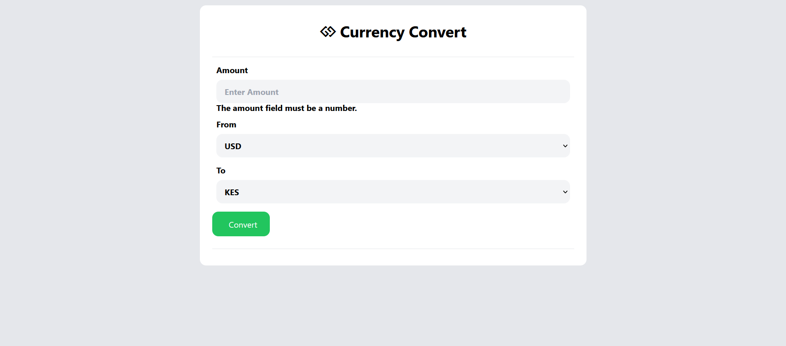

## Currency Converter
Currency Converter is a Laravel powered appliation that is utlizing curency conversion packages from  [Laravel Currency Converter(https://github.com/mgcodeur/laravel-currency-converter)]
that Effortlessly convert currencies in your Laravel applications, no API key required. It's fast, easy, and completely free.
Converts currency from one to another currencies with ease.
## screenshots

## License

The Laravel framework is open-sourced software licensed under the [MIT license](https://opensource.org/licenses/MIT).
